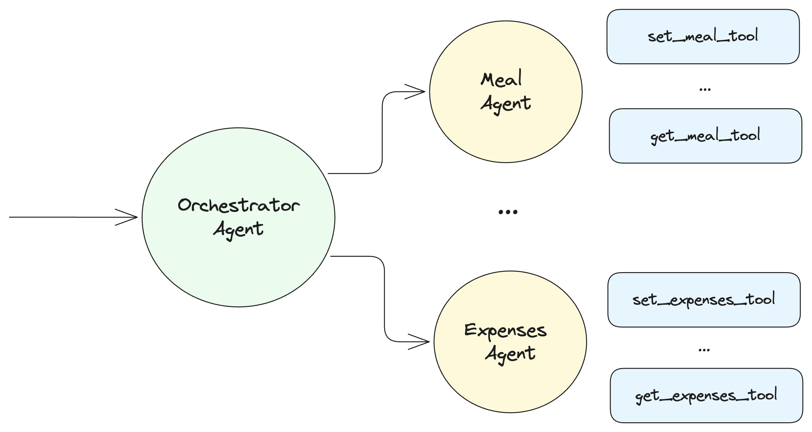

# PydanticAI Example Project

This project demonstrates the use of PydanticAI to create intelligent agents for managing team expenses and meal planning.

## Features

- 🤖 **Expenses Agent**: Manages and tracks team expenses in Argentinian style
- 🍽️ **Meal Planning Agent**: Helps plan and organize team meals with clear, direct responses

## Architecture

